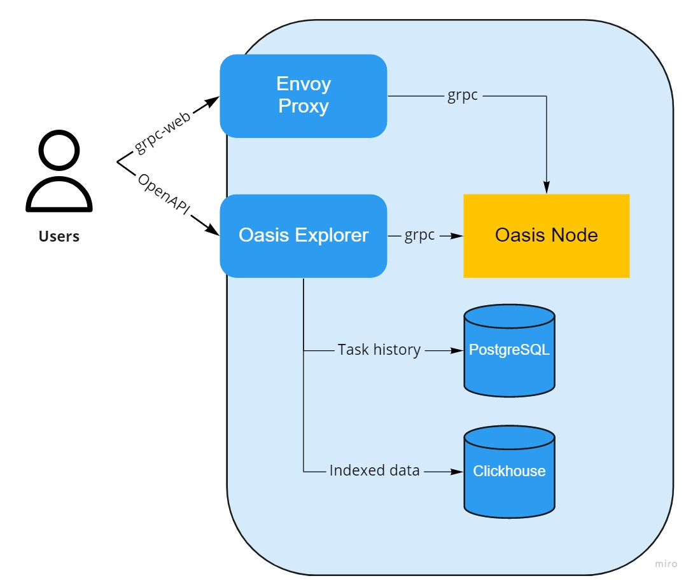

# Oasis Wallet

[](https://opensource.org/licenses/Apache-2.0)
[](https://codecov.io/gh/esya/oasis-wallet)
[](https://renovatebot.com/)
[](https://github.com/esya/oasis-wallet/actions)
[](https://app.fossa.com/projects/git%2Bgithub.com%2FEsya%2Foasis-wallet?ref=badge_shield)

> :warning: This wallet is still a work in progress and is not compatible yet with the Mainnet. **NEVER use the private keys and mnemonics given as example in this repository. Do not use this wallet with real ROSE tokens until a stable release is out.**


- [Oasis Wallet](#oasis-wallet)
  - [Features](#features)
    - [Additional features coming soon](#additional-features-coming-soon)
  - [Getting started](#getting-started)
    - [Installing and running oasis-wallet](#installing-and-running-oasis-wallet)
    - [Test accounts](#test-accounts)
  - [Architecture](#architecture)
  - [Contributing & development](#contributing--development)
    - [Running the tests](#running-the-tests)
    - [Code style](#code-style)
    - [Internationalization](#internationalization)

## Features

- Opening wallets through private key or mnemonic
- Transaction history, currently all transactions are listed. We need to submit a pull-request to [oasis-explorer](https://github.com/everstake/oasis-explorer) to support pagination
- Multiple languages (English and French currently supported)
- Submitting transactions

### Additional features coming soon

- [Ledger](http://ledger.com/) support
- Multiple accounts open in parallel
- Staking (Adding / reclaiming escrow)
- Staking rewards and history
- Debonding 
- Various account & network stats
- OETH Support 

## Getting started

### Installing and running oasis-wallet

You can quickly get started with a local network with the following command : 

```shell
docker-compose up --build -d
yarn install
yarn start
```

Then go to [http://localhost:3000](http://localhost:3000) to access the wallet.

### Test accounts

The local single-node network used for development comes built-in with two accounts already having tokens.

```
Using a private key : 
X0jlpvskP1q8E6rHxWRJr7yTvpCuOPEKBGW8gtuVTxfnViTI0s2fBizgMxNzo75Q7w7MxdJXtOLeqDoFUGxxMg==
oasis1qz0k5q8vjqvu4s4nwxyj406ylnflkc4vrcjghuwk

Using a mnemonic : 
abuse gown claw final toddler wedding sister parade useful typical spatial skate decrease bulk student manual cloth shove fat car little swamp tag ginger
oasis1qq8dt2jxf57kuszg3mdf78wtkggsvtuepctlftnn
```


## Architecture

Oasis-wallet needs multiple components to run, all provided in the [docker-compose file](docker-compose.yml) for local development.



- [envoy-proxy](https://www.envoyproxy.io/), used as a gRPC gateway for live access to the oasis-node, to fetch live balance, information about the current state of the network, and to submit transasctions.
- [oasis-explorer](https://github.com/everstake/oasis-explorer), a block indexer to store historical data about transactions, accounts, validators, rewards, blocks and mores. It exposes an [OpenAPI](https://github.com/everstake/oasis-explorer/blob/master/swagger/swagger.yml). `oasis-explorer` requires two databases :
  - A PostgreSQL instance to keep track of it's import batches
  - A [Clickhouse](https://github.com/ClickHouse/ClickHouse) server to store the indexed data

## Contributing & development

### Running the tests

The repository has two different test strategies :

- E2E (End-to-end) tests, ran with [Cypress](https://www.cypress.io/), located in [cypress/](/cypress). These tests require the react app to be started on accessible on port `3000` and the docker-compose stack to be up.
- Unit & functional tests, ran with [Jest](https://github.com/facebook/jest), located throughout the codebase

To run all tests : 

```bash
# Run jest tests
yarn test

# Run cypress tests
docker-compose up -d
yarn start # Run this in another terminal to keep it open
yarn cypress:run
```

### Code style

This repository uses [prettier](https://prettier.io/) as a code formatter and [eslint](https://github.com/eslint/eslint) as it's linter. You can use the following commands :

```bash
# Lint the whole repository
yarn lint

# Fix linting issues
yarn lint:fix
```

### Internationalization

Oasis-wallet uses [react-i18next](https://react.i18next.com/) for I18n. You can simply use the [useTranslation hook](https://react.i18next.com/latest/usetranslation-hook) inside your components to add additional i18n-ready strings. You can then export the new keys to the translation files by running 

```
yarn run extract-messages
```

To add a new language, edit [src/locales/i18n.ts](src/locales/i18n.ts) and [i18next-scanner.config.js](internals/extractMessages/i18next-scanner.config.js), then run the command above once more.

## License
[](https://app.fossa.com/projects/git%2Bgithub.com%2FEsya%2Foasis-wallet?ref=badge_large)
